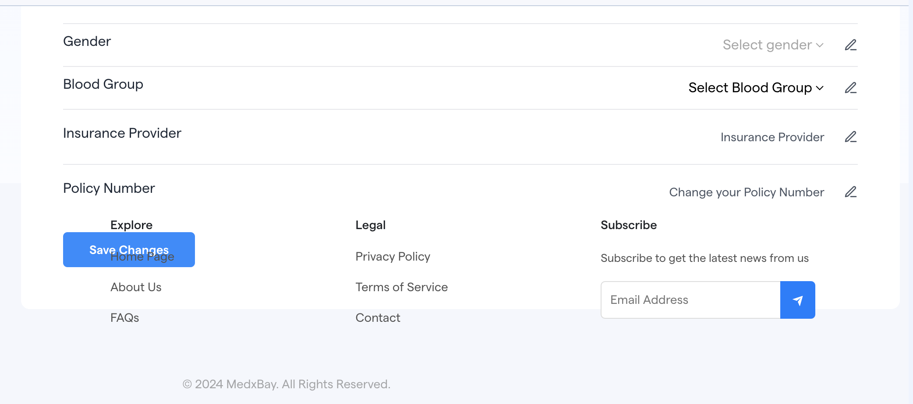

# Immediate Updates to live site

Status: In progress

## Sept. 17 updates

### Menu

- Change logo to this: ‣
- Reorder menu to the following:
    - **Find Provider** stays in 1st position
    - For provider change to **Dr/Physician**, make this 2nd menu item and use [**this copy**](https://docs.google.com/document/d/1VOEXFvB4Ja4hqWOanIHN5g0Bwi08cc1GD2bB4qVDuM4/edit?usp=sharing) for that page
    - For Corporate, change to **Enterprise**, make this 3rd menu item and use [**this copy**](https://docs.google.com/document/d/1CzvYTIg-DfwLMQ5_WpPoC2lpXv1QQQ_wwQtPucgl-5A/edit?usp=drive_link) for that page
    - Add **Patients** and use [**this copy**](https://docs.google.com/document/d/1uKmrW9K78iokm2zukE2bo0sA4wxWPyycep47Oz5jN60/edit?usp=sharing) for that page, make this the 4th menu item
    - **Condition Libraries**, make this the 5th menu item
    - **About**, make this the 6th menu item

### Providers section of home page

### **Together, We Revolutionize Healthcare**

In the rapidly evolving world of healthcare, MedxBay is designed with you in mind. We see the strain of endless paperwork, fragmented systems, and missed patient connections. These hurdles can add to an already demanding environment, but with MedxBay, you are no longer navigating this alone. Our platform is built to lift the burden, so you can focus on what you do best: **caring for your patients**

[LEARN MORE BUTTON] - Goes to [**Dr/Physician page**](https://docs.google.com/document/d/1VOEXFvB4Ja4hqWOanIHN5g0Bwi08cc1GD2bB4qVDuM4/edit?usp=sharing)

### Patients section of home page

*Use this copy to replace the bullet points above*

### Discover a Better Way to Manage Your Health with MedxBay

MedxBay is your all-in-one platform for finding trusted healthcare providers, booking appointments with ease, and staying connected to your care—all from the comfort of home. Whether you're looking for in-person visits or telehealth consultations, MedxBay helps you access the right care, manage your health records, and communicate securely with your providers. Take control of your healthcare journey with accurate, reliable information and tools designed to fit your needs.

**Sign up for free today and start managing your health effortlessly!**

[SIGN UP BUTTON] and [LEARN MORE BUTTON] - This goes to [**patient page**](https://docs.google.com/document/d/1uKmrW9K78iokm2zukE2bo0sA4wxWPyycep47Oz5jN60/edit?usp=sharing)

### Afya section of home page

**Move section up to reduce amount of space between patient section and Afya section**

Add that Afya will launch in Q4 of 2024

### Blog section of home page

Add actual blog posts with real content

***All blog posts live here:*** https://drive.google.com/drive/folders/1Rl3BiufQ1haU1tLdhikk52H8He0B7DMk?usp=sharing

### Footer

- Change logo to this: ‣
- FAQS page copy is [**here**](https://docs.google.com/document/d/1AJoe6v--dyeqoGZAQwwz0HUE0QpFuM2KBPRuzvhN-x8/edit?usp=sharing). Current page info is incorrect.
- Privacy Policy copy is **here**
- Add Youtube channel icon and link to [**here**](https://www.youtube.com/@MedxBaychannel)
- Contact page should be a simple form that sends messages to marketing@medxbay.com
- Subscribe section: Need to connect to Zoho marketing so that we can properly track and nurture them

### Patient Log-in

- I opened this in a new browser, incognito and this is what it looks like when I try to save my new information

###